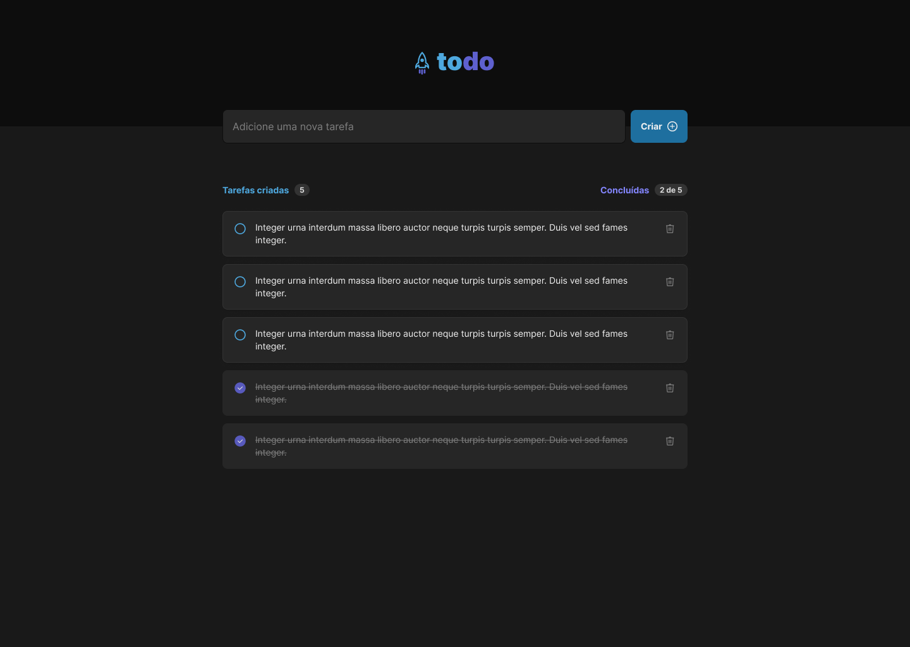

# Desafio - ToDo List

Esse projeto foi desenvolvido para praticar os conceitos básicos do ReactJS, nele criamos uma lista de tarefas com as funcionalidades de criar, deletar, marcar e desmarcar a tarefa.

## 🚀 Tecnologias

- 🛠️ Vite
- 💻 Typescript
- 🎨 CSS Modules

## ☁️ Deploy

Você pode visualizar o deploy do projeto através <a target="_blank" href="https://01-praticando-os-conceitos-reactjs.vercel.app/">DESSE LINK</a>.
